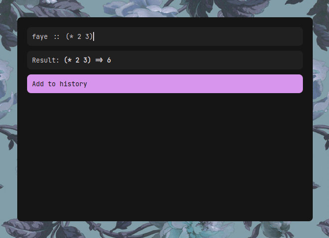

# rofi-faye

eager evaluation for [faye](https://codeberg.org/fawn/faye) in [rofi](https://github.com/davatorium/rofi).

    
Video showcase

[showcase.webm](https://github.com/user-attachments/assets/d1c9d9c1-8ae4-483c-84fb-4310c08eb50f)

## Requirements

- (Optional) `xclip` for X11, `wl-copy` for wayland. Required to copy results to clipboard.

## Installation

Clone the repo and change directroy into it.

    just install

or

    cargo build --release
    sudo cp -u ./target/release/librofi_faye.so /lib/rofi/faye.so

## Usage

    rofi -modi faye -show faye

## Acknowledgements

- [rofi-calc](https://github.com/svenstaro/rofi-calc) - this project is **HEAVILY** inspired by and modeled after rofi-calc.

## License

[Apache-2.0](LICENSE)
